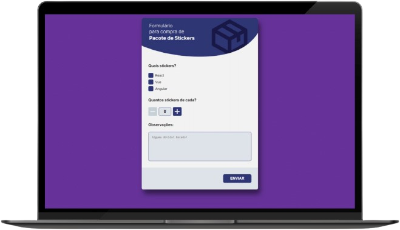

# Desafio Front-End Vagas.com 2020
<!-- 
https://shields.io/
/github/repo-size/:user/:repo - tamanho do repositorio
/tokei/lines/:provider/:user/:repo - total de linhas
-->

<!-- 
 -->

<!-- Descrição sobre o desafio -->

Para quem se interassar, o desafio está disponível no [Github do Vagas.com](https://github.com/VAGAScom/desafio-front-end).

## O Projeto

> Projeto desenvolvido com o intuíto de aprimorar minhas habilidades de HTML, CSS e Javascript através de desafios reais. Este projeto foi retirado do [repositório frontend-challenges](https://github.com/felipefialho/frontend-challenges) na qual possui uma lista de desafios Front-end.

## Desenvolvimento

Desenvolvido utilizando as linguagens HTML, CSS e Javascript, o desafio consiste em deixar o HTML o mais semântico possível, utilizando as tags HMTL adequadas; deixar a página acessivel e deixar o contador funcional para que o usuário possa alterar a quantidade tanto pelos botões quanto manualmente.

Mais detalhes estão disponíveis no [repositório do desafio](https://github.com/VAGAScom/desafio-front-end).

[⬆ Voltar ao topo](#Desafio-Front-End-Vagas.com-2020)